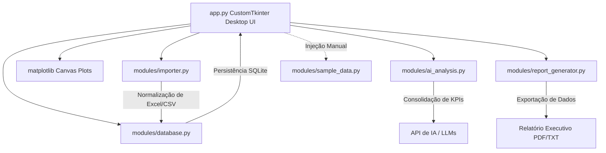

# 📊 SmartBI Python AI Assistant (Desktop Edition)

> **Plataforma nativa de Business Intelligence para desktop desenvolvida em Python, com integração SQLite local, dashboards gráficos integrados e insights estratégicos acionados por Inteligência Artificial (LLMs) em segundo plano.**

[](https://www.python.org/)
[](https://github.com/tomschimansky/CustomTkinter)
[](https://www.sqlite.org/)
[](https://matplotlib.org/)
[](LICENSE)

---

## 🎯 Objetivo do Projeto

O **SmartBI Python AI Assistant (Desktop Edition)** é um ecossistema completo de automação e análise empresarial offline. Projetado para portfólios de engenharia de software e automação com Python, ele substitui interfaces baseadas na web por uma **aplicação desktop robusta e extremamente elegante** desenvolvida em **CustomTkinter** com gráficos de alta performance renderizados em **Matplotlib**.

A plataforma permite importar planilhas brutas de vendas (Excel/CSV), higienizar e normalizar dados automaticamente, consolidá-los em banco relacional SQLite local, explorar métricas dinamicamente através de um dashboard desktop de tema escuro premium, gerar pareceres consultivos executivos via APIs de IA (executados de forma assíncrona por Threads em background) e exportar relatórios de alta fidelidade visual em formato PDF e TXT.

---

## 🚀 Funcionalidades Principais

### 1. 📥 Motor de Importação e Normalização
* **Detecção Automática de Layout:** Mapeamento inteligente de cabeçalhos redundantes ou variações idiomáticas (ex: *Qtd, Quantidade, Volume* mapeiam para o mesmo campo).
* **Tratamento de Dados Robuto:** Conversão automática de strings financeiras brasileiras (ex: `R$ 1.200,50` para `1200.50`), prevenção de valores nulos e correções de encoding (UTF-8/Latin-1).
* **Consolidação Financeira:** Cálculo automático em tempo real de faturamento bruto, lucro líquido estimado e margem de contribuição.

### 2. 🗄️ Banco de Dados Relacional (SQLite)
* **Persistência Estruturada:** Criação e manutenção automática de schemas locais e pastas físicas.
* **Cascateamento de Lotes:** Histórico de uploads permitindo a exclusão de lotes com remoção em cascata (`ON DELETE CASCADE`), mantendo a consistência referencial.

### 3. 📊 Dashboard Desktop Premium (CustomTkinter + Matplotlib)
* **Design Dark Mode Premium:** Interface esteticamente refinada baseada no CustomTkinter, contendo cartões de KPIs dinâmicos, sombreamento suave, cantos arredondados e transições de hover.
* **Gráficos Integrados:** Curva de evolução comercial e faturamento das maiores categorias renderizados de forma limpa e nativa na janela do aplicativo através do Matplotlib.
* **Tabela de Dados Inteligente:** Grelha de visualização dinâmica com suporte a filtros de categoria em tempo real e buscas textuais de produtos sob demanda.

### 4. 🧠 Consultoria Estratégica via IA (LLMs)
* **Multiprovedor Flexível:** Integração parametrizada com **OpenAI (GPT-4o-mini/GPT-4)**, **Gemini**, **Groq** ou **Ollama** executando localmente.
* **Assincronismo Inteligente (Threads):** Chamadas de API efetuadas em segundo plano por Threads em background, impedindo o congelamento da interface desktop do usuário e fornecendo feedbacks dinâmicos de carregamento.
* **Estatística Heurística de Fallback:** Caso nenhuma chave de API esteja ativa ou ocorra falha de rede, a aplicação aciona um motor heurístico baseado em estatísticas descritivas, garantindo uma demonstração funcional offline para recrutadores.

### 5. 📝 Exportador de Relatórios Executivos
* **ReportLab Engine:** Conversão de marcações em Markdown da IA para elementos estruturados em PDF de alta qualidade.
* **Layout Corporativo:** Margens precisas, grid financeiro de KPIs, tabelas de recordistas de vendas, rodapés automatizados ("Página X de Y") e aviso de confidencialidade.
* **Versão em Texto de Fallback:** Geração sob demanda de versão `.txt` limpa e estruturada.

---

## 🛠️ Arquitetura de Software Modular

O projeto foi construído respeitando as melhores práticas de **Clean Code**, separação de responsabilidades (S.O.L.I.D.) e portabilidade:



### 📁 Estrutura de Pastas

```
smartbi-python-ai/
│── app.py                 # Ponto de entrada da aplicação Desktop nativa (UI e Navegação)
│── requirements.txt       # Declaração exata de dependências do projeto
│── .env                   # Variáveis de ambiente e credenciais de IA (Ignorado no Git)
│── README.md              # Documentação premium do portfólio
│── database/
│   └── smartbi.db         # Banco de dados SQLite persistente
│── data/
│   ├── uploads/           # Armazenamento temporário de uploads
│   └── reports/           # PDFs e TXTs executivos gerados para download
│── modules/
│   ├── importer.py        # Pipeline de ETL, limpeza e mapeamento de colunas
│   ├── database.py        # Camada de abstração e consultas ao SQLite
│   ├── ai_analysis.py     # Cliente de conexões com provedores de IA e Fallback Heurístico
│   ├── report_generator.py# Motor PDF (ReportLab) e TXT de relatórios
│   └── sample_data.py     # Gerador de dados fictícios para demonstração corporativa
```

---

## ⚙️ Instalação e Execução

### Pré-requisitos
* Python 3.11 ou superior instalado.
* Gerenciador de pacotes `pip`.

### 1. Clonar o Repositório
```bash
git clone https://github.com/seu-usuario/smartbi-python-ai.git
cd smartbi-python-ai
```

### 2. Configurar o Ambiente Virtual (Recomendado)
```bash
python -m venv venv
# No Windows (PowerShell):
.\venv\Scripts\Activate.ps1
# No Linux/macOS:
source venv/bin/activate
```

### 3. Instalar as Dependências
```bash
pip install -r requirements.txt
```

### 4. Configurar as Credenciais
Configure as chaves e provedores na aba de **Configurações** da própria janela do aplicativo ou edite diretamente o arquivo `.env`:
```env
AI_PROVIDER=openai
AI_API_KEY=sua_chave_api_aqui
AI_MODEL=gpt-4o-mini
AI_API_URL=
```

### 5. Executar o Aplicativo Desktop Nativo
```bash
python app.py
```
A janela do aplicativo abrirá instantaneamente em sua área de trabalho!

---

## 💼 Casos de Uso Corporativo

* **Apresentação de Resultados Bimestrais:** Importe os fechamentos de faturamento da empresa e gere o relatório em PDF com o parecer estratégico em segundos para a reunião de diretoria.
* **Identificação de "Vazamento de Lucro":** O dashboard e o motor analítico destacam de forma imediata quais produtos possuem margem muito apertada em relação ao volume comercializado, permitindo renegociações imediatas.
* **Automação de Marketing Dinâmico:** Use as sugestões estratégicas de *cross-selling* fornecidas pelo assistente de IA para criar e disparar campanhas promocionais de combos de produtos de alta sinergia.

---

## 📄 Licença

Este projeto está licenciado sob a licença MIT - consulte o arquivo [LICENSE](LICENSE) para obter detalhes.

---

*Desenvolvido com foco em excelência técnica, portfólio profissional e resultados reais.*
